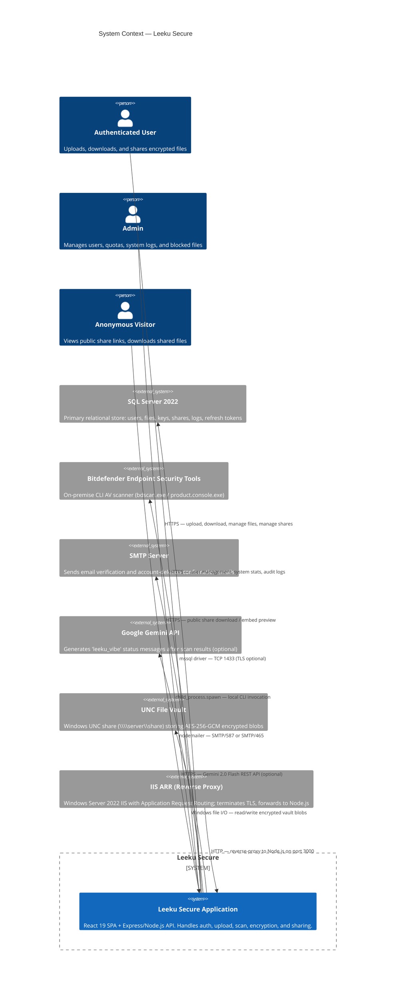
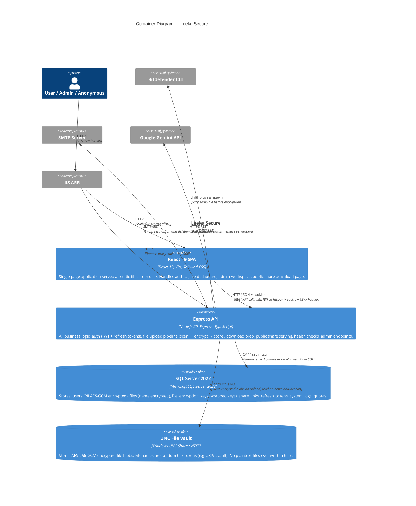
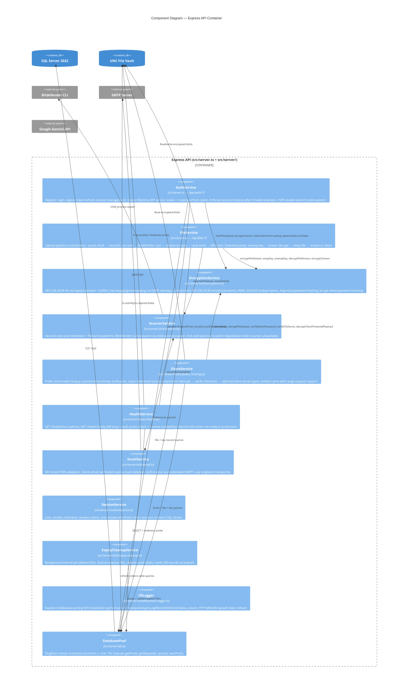
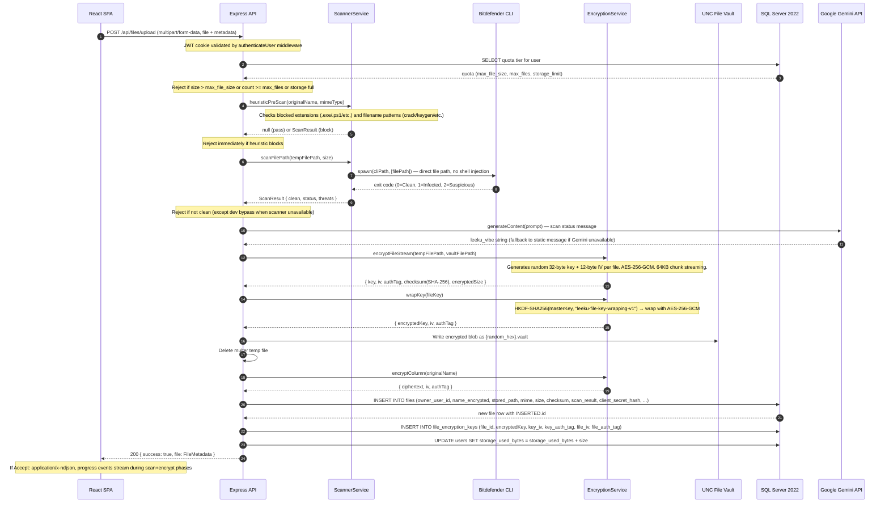
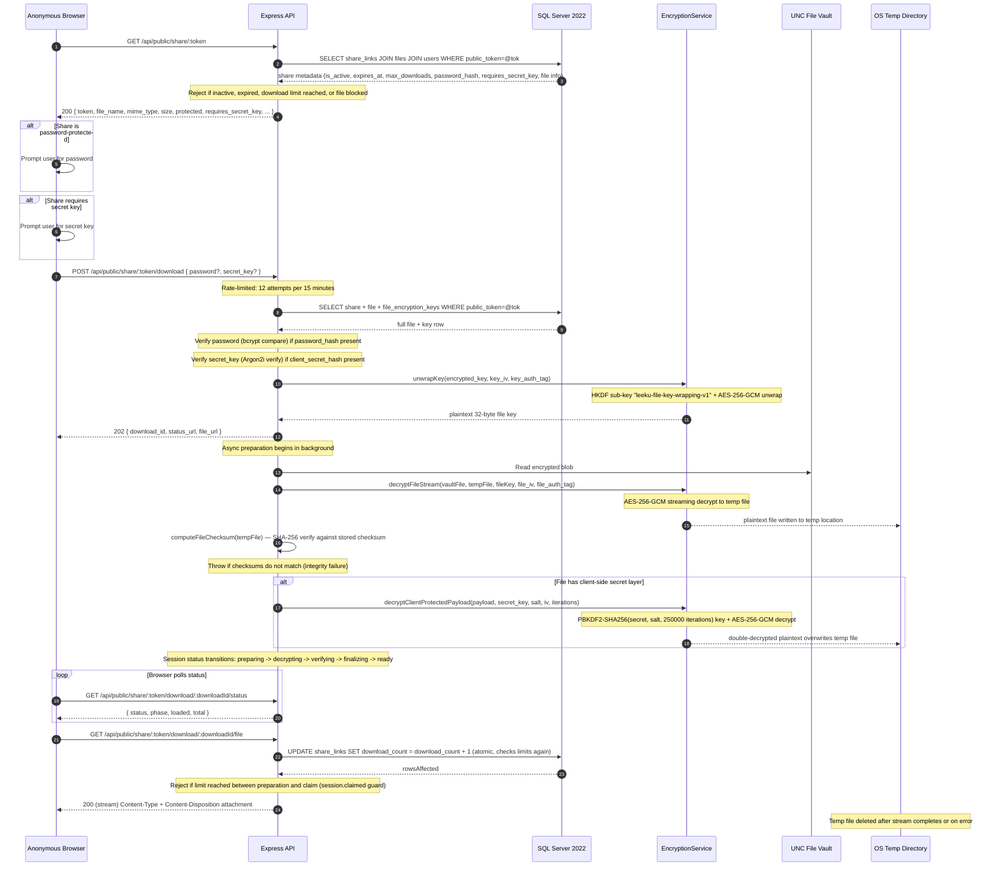

# Leeku Secure — Architecture

> **Platform:** Windows Server 2022 / IIS ARR + Node.js 20 + React 19 + SQL Server 2022
> **License:** Apache-2.0

---

## Table of Contents

1. [C4 L1 — System Context](#c4-l1--system-context)
2. [C4 L2 — Container Diagram](#c4-l2--container-diagram)
3. [C4 L3 — Component Diagram](#c4-l3--component-diagram)
4. [Sequence: File Upload Flow](#sequence-file-upload-flow)
5. [Sequence: Authentication Flow](#sequence-authentication-flow)
6. [Sequence: Public Share Download](#sequence-public-share-download)
7. [ADR-001 — AES-256-GCM for File and Column Encryption](#adr-001--aes-256-gcm-for-file-and-column-encryption)
8. [ADR-002 — Argon2id for User Password Hashing](#adr-002--argon2id-for-user-password-hashing)
9. [ADR-003 — Symmetric JWT (HMAC-SHA256) with Refresh Token Rotation](#adr-003--symmetric-jwt-hmac-sha256-with-refresh-token-rotation)
10. [ADR-004 — UNC File Vault for Encrypted File Storage](#adr-004--unc-file-vault-for-encrypted-file-storage)

---

## C4 L1 — System Context

Actors and their relationship to Leeku Secure and its external dependencies.



**Evidence:**
- Actors (User, Admin, Anonymous) ✅ CONFIRMED — `src/server.ts`: role-based middleware `verifyAdmin`, public routes under `/api/public/share/:token`
- SQL Server 2022 ✅ CONFIRMED — `src/server/db.ts` header comment; `mssql` package; `DB_NAME=LeekuSecure` default
- Bitdefender CLI ✅ CONFIRMED — `src/server/utils/scanner.ts`: `spawn(cliPath, ...)`, auto-detect paths under `C:\Program Files\Bitdefender\`
- SMTP ✅ CONFIRMED — `src/server/utils/email.ts`: `nodemailer.createTransport`, `SMTP_HOST/SMTP_USER/SMTP_PASSWORD`
- Google Gemini ✅ CONFIRMED — `src/server.ts` L23: `import { GoogleGenAI }`, `GEMINI_API_KEY`, model `gemini-2.0-flash`
- UNC Vault ✅ CONFIRMED — `src/server.ts` L79: `FILE_STORAGE_UNC_PATH`, L323-342: `net use` mount logic; `src/server/utils/expiry-cleanup.ts`: UNC path deletion
- IIS ARR ⚠️ INFERRED — `src/server/middleware/iis-logger.ts` writes W3C Extended Log Format to `C:\inetpub\logs\LogFiles\W3SVC{n}` confirming IIS co-deployment; ARR inferred from Windows Server 2022 deployment context and `PROXY_TRUST_HOPS` env var support (`src/server.ts` L428)

---

## C4 L2 — Container Diagram

The four runtime containers and how data flows between them.



**Evidence:**
- React 19 SPA ✅ CONFIRMED — `src/client.tsx`, `vite.config.ts`, `src/app/app.tsx`; `build.outDir = 'dist'` (`vite.config.ts` L15)
- Express API ✅ CONFIRMED — `src/server.ts` L14-16: `import express`, port 3000 (`src/server.ts` L76)
- SQL Server 2022 ✅ CONFIRMED — `src/server/db.ts`
- UNC File Vault ✅ CONFIRMED — `src/server.ts` L79, L345-348; random hex filenames: `generateSecureToken(16) + '.vault'` (`src/server.ts` L1718)
- API-to-DB parameterised queries ✅ CONFIRMED — all queries use `request.input(...)` pattern in `src/server.ts`
- Cookie transport (HttpOnly + CSRF) ✅ CONFIRMED — `src/server.ts` L192-245: `httpOnly: true`, `CSRF_COOKIE_NAME`
- IIS static serving ⚠️ INFERRED — `vite.config.ts` builds to `dist/`; IIS W3C logging confirms co-location

---

## C4 L3 — Component Diagram

Internal modules of the Express API container and their responsibilities.



**Evidence:**
- AuthService route group ✅ CONFIRMED — `src/server.ts` L846-1126: `/api/auth/*` routes
- FileService route group ✅ CONFIRMED — `src/server.ts` L1465-1868: `/api/files/*` routes
- EncryptionService exports ✅ CONFIRMED — `src/server/utils/encryption.ts` full module
- ScannerService ✅ CONFIRMED — `src/server/utils/scanner.ts`
- ShareService ✅ CONFIRMED — `src/server/routes/public-sharing.ts`
- HealthService ✅ CONFIRMED — `src/server/routes/health.ts`
- EmailService ✅ CONFIRMED — `src/server/utils/email.ts`
- SessionService ✅ CONFIRMED — `src/server/routes/sessions.ts`
- ExpiryCleanupService ✅ CONFIRMED — `src/server/utils/expiry-cleanup.ts`
- IISLogger ✅ CONFIRMED — `src/server/middleware/iis-logger.ts`
- DatabasePool ✅ CONFIRMED — `src/server/db.ts`

---

## Sequence: File Upload Flow

Upload → heuristic scan → Bitdefender scan → stream encrypt → vault write → DB insert.



**Evidence:**
- Upload pipeline stages ✅ CONFIRMED — `src/server.ts` L1559-1868: `currentStage` variable tracks `quota_lookup → heuristic_scan → bitdefender_scan → encrypt_file → insert_file_record → insert_key_record → update_storage_usage`
- heuristicPreScan before Bitdefender ✅ CONFIRMED — `src/server.ts` L1667-1677, then L1687
- Stream encryption with 64KB chunks ✅ CONFIRMED — `src/server/utils/encryption.ts` L394: `highWaterMark: 64 * 1024`
- NDJSON progress streaming ✅ CONFIRMED — `src/server.ts` L1572-1588: `application/x-ndjson` content type, `res.write(JSON.stringify(payload) + '\n')`
- Gemini vibe generation after scan ✅ CONFIRMED — `src/server.ts` L1700, L1752: `generateLeekuVibe(original_name, true/false)`
- Client-side secret (optional extra layer) ✅ CONFIRMED — `src/server.ts` L1618-1637: `upload_secret_key` field; `src/app/shared/utils/client-file-secret.ts`: browser-side PBKDF2-SHA256 + AES-256-GCM pre-encryption

---

## Sequence: Authentication Flow

Login → JWT access token + rotating refresh token.

```mermaid
sequenceDiagram
    autonumber
    participant Browser as React SPA
    participant API as Express API
    participant Enc as EncryptionService
    participant DB as SQL Server 2022
    participant SMTP as SMTP Server

    Browser->>API: POST /api/auth/register { username, email, password }
    API->>API: validateMxRecord(email) — DNS MX lookup
    API->>DB: SELECT COUNT(*) WHERE email_hash=@h OR username_hash=@h (duplicate check)
    DB-->>API: { eE, uE }
    Note over API: Reject if email or username already registered

    API->>Enc: hashColumnForLookup(email), hashColumnForLookup(username)
    Note over Enc: HMAC-SHA256 with HKDF sub-key "leeku-column-hmac-v1"
    API->>Enc: encryptColumn(email), encryptColumn(username)
    Note over Enc: AES-256-GCM with HKDF sub-key "leeku-column-encryption-v1"
    API->>Enc: hashPassword(password)
    Note over Enc: Argon2id — 64 MiB, 3 iterations, 4 threads

    API->>DB: INSERT INTO users (email_encrypted, email_hash, username_encrypted, password_hash, ...)
    DB-->>API: inserted user row

    alt SMTP enabled
        API->>SMTP: sendVerificationEmail(email, username, token)
        API-->>Browser: 200 { message: "Check your email" }
        Note over Browser: User must verify email before login is permitted
    else SMTP disabled (dev)
        API->>DB: issueRefreshSession (INSERT refresh_tokens)
        API-->>Browser: 200 { user } + Set-Cookie: leeku_session (JWT) + leeku_refresh + leeku_csrf
    end

    Browser->>API: POST /api/auth/login { login, password }
    API->>Enc: hashColumnForLookup(login)
    API->>DB: SELECT user WHERE email_hash=@h OR username_hash=@h
    DB-->>API: user row with password_hash

    Note over API: Check: locked_until, Suspended status, email_verified (if SMTP enabled)
    API->>Enc: verifyPassword(password, hash)
    Note over Enc: Argon2 verify — timing-safe

    alt Password valid
        API->>DB: UPDATE users SET failed_login_count=0, last_login_at=NOW()
        API->>DB: issueRefreshSession — DELETE expired tokens, INSERT new refresh_tokens row
        Note over API: Refresh token stored as SHA-256 hash only; raw token in HttpOnly cookie
        API->>API: signToken(userId, role) — JWT signed with COOKIE_SECRET_BASE64
        Note over API: JWT: sub=userId, role, exp=15min, iss=APP_URL, aud=leeku-secure-api
        API-->>Browser: 200 { user } + Set-Cookie: leeku_session (JWT, HttpOnly) + leeku_refresh (HttpOnly, path=/api/auth) + leeku_csrf (readable)
    else Password invalid
        API->>DB: UPDATE users SET failed_login_count=N (lock if >= MAX_LOGIN_ATTEMPTS)
        API-->>Browser: 400 { error: "Invalid login or password" }
    end

    Note over Browser: On subsequent requests: sends leeku_session cookie + X-CSRF-Token header

    Browser->>API: POST /api/auth/refresh (leeku_refresh cookie)
    API->>DB: SELECT user JOIN refresh_tokens WHERE token_hash=@hash AND revoked_at IS NULL AND expires_at > NOW()
    DB-->>API: user row
    API->>DB: UPDATE refresh_tokens SET revoked_at=NOW() (revoke old token)
    API->>DB: INSERT new refresh_tokens row (token rotation)
    API-->>Browser: 200 { user, csrfToken } + new leeku_session + new leeku_refresh cookies
```

**Evidence:**
- Argon2id parameters ✅ CONFIRMED — `src/server/utils/encryption.ts` L43-48: `type: argon2id, memoryCost: 65536, timeCost: 3, parallelism: 4`
- JWT expiry default 15 min ✅ CONFIRMED — `src/server.ts` L88: `JWT_ACCESS_EXPIRY_SECONDS = 900`
- JWT payload fields ✅ CONFIRMED — `src/server.ts` L479: `interface JwtPayload { sub: string; role: string; }`
- JWT issuer/audience ✅ CONFIRMED — `src/server.ts` L90-91: `JWT_ISSUER`, `JWT_AUDIENCE = 'leeku-secure-api'`
- Refresh token stored as SHA-256 hash ✅ CONFIRMED — `src/server.ts` L497-499: `hashRefreshToken()` uses `crypto.createHash('sha256')`
- Token rotation ✅ CONFIRMED — `src/server.ts` L546-574: `rotateRefreshSession()` revokes old, inserts new
- CSRF double-submit ✅ CONFIRMED — `src/server.ts` L274-309: `requireCsrfForCookieSession`, compares `X-CSRF-Token` header to `leeku_csrf` cookie
- Account lockout ✅ CONFIRMED — `src/server.ts` L83-84: `MAX_LOGIN_ATTEMPTS=5`, `LOCKOUT_DURATION_MINUTES=15`
- HMAC-SHA256 column lookup hashes ✅ CONFIRMED — `src/server/utils/encryption.ts` L210-216
- MX record validation on register ✅ CONFIRMED — `src/server.ts` L858-862; `src/server/utils/email.ts` L73-101

---

## Sequence: Public Share Download

Anonymous user downloads a file via a public share link.



**Evidence:**
- Three-phase async preparation (decrypting → verifying → finalizing) ✅ CONFIRMED — `src/server/routes/public-sharing.ts` L382-434
- Checksum verification ✅ CONFIRMED — `src/server/routes/public-sharing.ts` L399-408: `computeFileChecksum` vs `row.checksum_sha256`
- Client-secret second layer decryption ✅ CONFIRMED — `src/server/routes/public-sharing.ts` L410-434: `decryptClientProtectedPayload`
- Atomic download counter with guard ✅ CONFIRMED — `src/server/routes/public-sharing.ts` L510-519: `UPDATE ... WHERE download_count < max_downloads`; L503-505: `session.claimed` flag
- Session TTL 10 min ✅ CONFIRMED — `src/server/routes/public-sharing.ts` L66: `DOWNLOAD_SESSION_TTL_MS = 10 * 60_000`
- Rate limit: 12 per 15 min ✅ CONFIRMED — `src/server/routes/public-sharing.ts` L313-315: `PUBLIC_SHARE_DOWNLOAD_ATTEMPTS_PER_15_MIN = 12`
- Embed endpoint for images/videos with range requests ✅ CONFIRMED — `src/server/routes/public-sharing.ts` L557-718: `/embed` route with `Accept-Ranges: bytes` and 206 partial content

---

## ADR-001 — AES-256-GCM for File and Column Encryption

**Status:** Accepted

**Context:** ✅ CONFIRMED — `src/server/utils/encryption.ts` L1-26 (module docstring): The platform must encrypt uploaded file bytes at rest and protect PII columns (email, username) in SQL Server. Requirements include authenticated encryption (tamper detection), key hierarchy isolation between files and PII, and streaming support for large files on Windows Server 2022.

**Decision:** ✅ CONFIRMED — AES-256-GCM (`aes-256-gcm`, 32-byte key, 12-byte IV, 16-byte auth tag) is used for:

1. **File content** — unique random key and IV per file (`crypto.randomBytes(32)` / `crypto.randomBytes(12)`) stored as encrypted keys in `file_encryption_keys`
2. **Key wrapping** — per-file keys are wrapped using a HKDF-SHA256 sub-key (`leeku-file-key-wrapping-v1`) derived from `MASTER_KEY_BASE64`
3. **PII columns** — email and username are encrypted with a separate HKDF sub-key (`leeku-column-encryption-v1`); lookup is via HMAC-SHA256 hashes (`leeku-column-hmac-v1`)
4. **Client-side secret layer** (optional) — browser uses Web Crypto API AES-256-GCM + PBKDF2-SHA256 (250,000 iterations) before upload; server applies a second decrypt on download

**Consequences:**

- ✅ CONFIRMED Authenticated encryption — GCM auth tag prevents silent data corruption and detects tampering; `decipher.setAuthTag()` is called before `final()`, causing an exception on mismatch
- ✅ CONFIRMED Streaming encryption avoids loading entire files into memory — `encryptFileStream`/`decryptFileStream` use 64KB chunks
- ⚠️ INFERRED Master key rotation requires re-wrapping all file keys — no key rotation mechanism exists in the current codebase
- ⚠️ INFERRED HKDF sub-key isolation means compromise of one purpose's derived key does not expose other purposes
- ⚠️ INFERRED No hardware security module (HSM) is used; master key lives in `MASTER_KEY_BASE64` env variable — depends on OS-level secret management for protection

---

## ADR-002 — Argon2id for User Password Hashing

**Status:** Accepted

**Context:** ✅ CONFIRMED — `src/server/utils/encryption.ts` L43-48: The platform hashes user passwords before storage. OWASP 2024 minimum guidelines were explicitly cited in the source code comment.

**Decision:** ✅ CONFIRMED — Argon2id with `{ memoryCost: 65536 (64 MiB), timeCost: 3, parallelism: 4 }` via the `argon2` npm package. The PHC string format is stored in `users.password_hash`.

Supporting choices by credential type (all ✅ CONFIRMED from `src/server/utils/encryption.ts`):

| Credential | Algorithm | Parameters |
|---|---|---|
| User passwords | Argon2id | 64 MiB, 3 iterations, 4 threads |
| Share link passwords | bcrypt | cost factor 12 |
| Optional file secret keys | Argon2i | 64 MiB, 3 iterations, 4 threads |

**Consequences:**

- ✅ CONFIRMED Resistance to GPU/ASIC attacks — large memory cost (64 MiB) makes parallel cracking expensive
- ✅ CONFIRMED Argon2id combines the side-channel resistance of Argon2i with the GPU resistance of Argon2d
- ⚠️ INFERRED Login latency ~100–500ms per verification on typical server hardware — acceptable for authentication but must be accounted for under brute-force conditions (mitigated by account lockout after 5 attempts)
- ⚠️ INFERRED bcrypt for share passwords is slightly weaker than Argon2id but appropriate for lower-value credentials with shorter lifetimes

---

## ADR-003 — Symmetric JWT (HMAC-SHA256) with Refresh Token Rotation

**Status:** Accepted

**Context:** ✅ CONFIRMED — `src/server.ts` L88-91, L481-495: The platform needs stateless short-lived session tokens with the ability to invalidate sessions without rebuilding a full server-side session store. Multiple concurrent sessions per user must be supported with individual revocation.

**Decision:** ✅ CONFIRMED — JWT access tokens signed with `COOKIE_SECRET_BASE64` (symmetric HMAC via `jsonwebtoken`). Tokens are delivered exclusively via `HttpOnly; SameSite=Lax` cookies, not in Authorization headers from the browser. Parameters:

- **Access token expiry:** 15 minutes (default `JWT_ACCESS_EXPIRY_SECONDS=900`)
- **Refresh token expiry:** 7 days (default `JWT_REFRESH_EXPIRY_SECONDS=604800`)
- **Refresh token storage:** SHA-256 hash stored in `refresh_tokens` table; raw token in `HttpOnly` cookie scoped to `/api/auth`
- **Token rotation:** ✅ CONFIRMED — `rotateRefreshSession()` revokes the presented token and issues a new one atomically (`src/server.ts` L546-574)
- **CSRF protection:** Double-submit cookie — `leeku_csrf` cookie value must match `X-CSRF-Token` header for all mutating requests using cookie-based auth (`src/server.ts` L274-309)

**Consequences:**

- ✅ CONFIRMED Short access token lifetime (15 min) limits the window for stolen token misuse
- ✅ CONFIRMED Refresh token rotation detects replay: if a stolen refresh token is used, the legitimate session is automatically invalidated
- ✅ CONFIRMED Individual session revocation is possible (by session ID or token hash) via the SessionService
- ⚠️ INFERRED Symmetric signing means any process with the `COOKIE_SECRET_BASE64` can forge tokens — RS256 (asymmetric) would isolate verification from signing but was not chosen, likely to avoid key-pair management complexity in a single-server Windows deployment
- ⚠️ INFERRED Access tokens cannot be individually revoked before expiry — a 15-minute window exists for a compromised but not-yet-expired token; refresh revocation does not invalidate outstanding access tokens

---

## ADR-004 — UNC File Vault for Encrypted File Storage

**Status:** Accepted

**Context:** ✅ CONFIRMED — `src/server.ts` L79: `FILE_STORAGE_UNC_PATH` env var; L323-342: `net use` UNC mount logic; `src/server/utils/production.ts` L17: `FILE_STORAGE_UNC_PATH` is a required production variable. Encrypted file blobs must be stored separately from the application binary and database, on a path accessible to the Windows service account, with the option to be a network share for capacity scaling.

**Decision:** ✅ CONFIRMED — Encrypted vault blobs are written to a configurable UNC path (`\\server\share`) or local fallback path. At startup, the server optionally calls `net use` to authenticate the share using `STORAGE_NET_USE_USER` / `STORAGE_NET_USE_PASS` env vars. Files are stored with opaque random hex names (`generateSecureToken(16) + '.vault'`) with no directory structure revealing ownership.

Key vault properties:
- All blobs are AES-256-GCM encrypted before writing — the vault stores no plaintext
- Bitdefender scan temp files are written to a **separate** local path (`FILE_SCAN_TEMP_PATH`, default `C:\LeekuTemp\scan-staging`) because UNC shares cannot be scanned by Bitdefender CLI (✅ CONFIRMED — `src/server/utils/scanner.ts` L36-37 comment)
- Download preparation decrypts to a separate local temp directory (`UPLOAD_TEMP_PATH`) and streams from there

**Consequences:**

- ✅ CONFIRMED Separating encrypted storage from the application host reduces blast radius — a compromise of the web server does not expose plaintext files without also compromising the master key
- ✅ CONFIRMED UNC path enables horizontal storage capacity scaling by pointing to a file server or NAS
- ⚠️ INFERRED Network share latency adds overhead to upload encryption and download decryption pipeline compared to local NVME storage
- ⚠️ INFERRED Windows file locking on UNC shares creates race conditions during concurrent embed cache writes — mitigated by the retry/backoff logic in `src/server/routes/public-sharing.ts` L168-238
- ✅ CONFIRMED Bitdefender CLI cannot scan UNC paths — confirmed by the architectural decision to scan from a local staging directory before encryption, not after vault write
