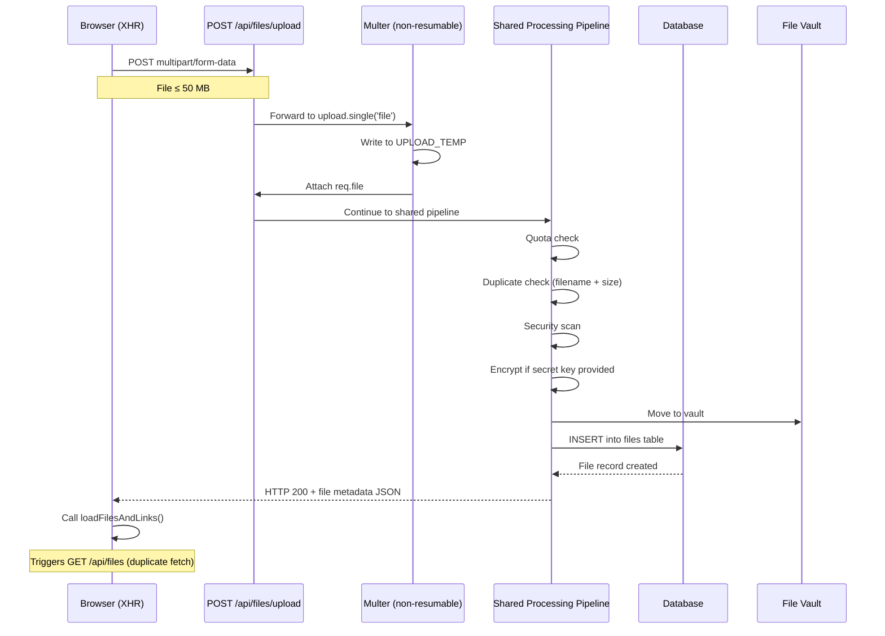
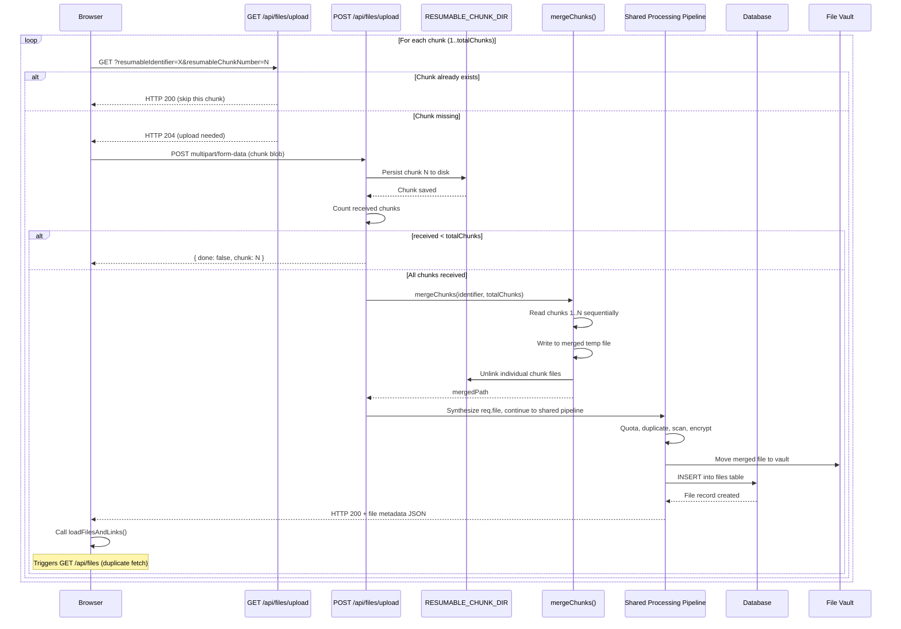
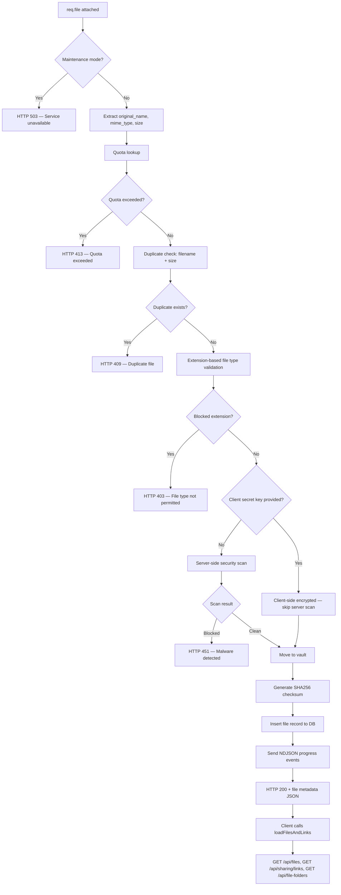
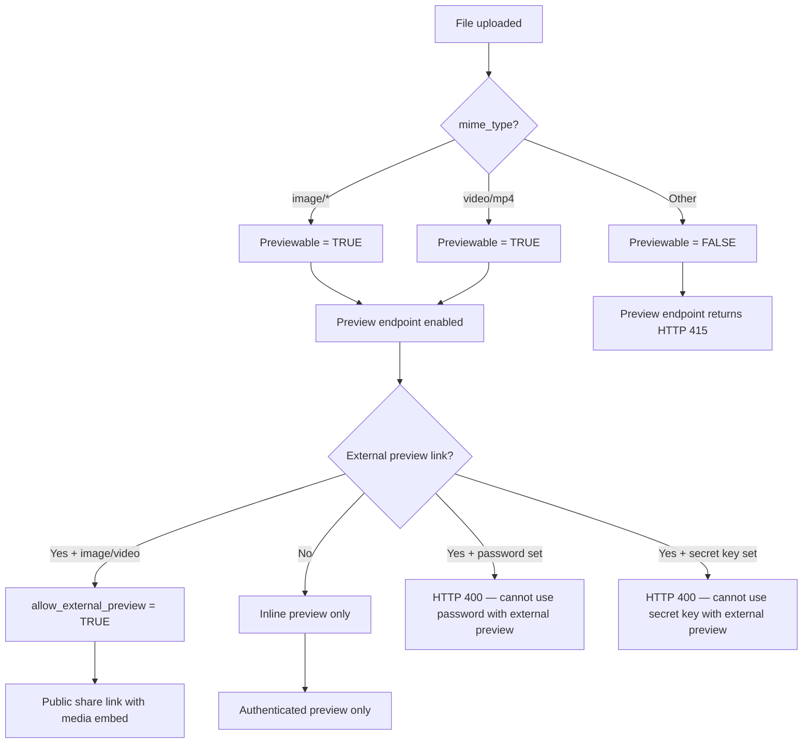
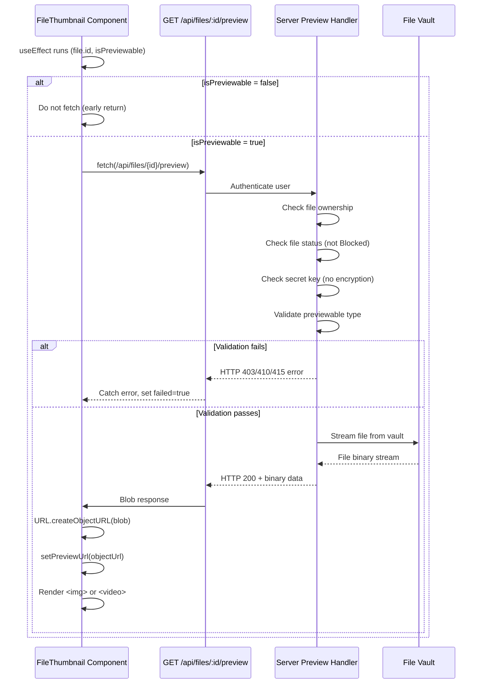
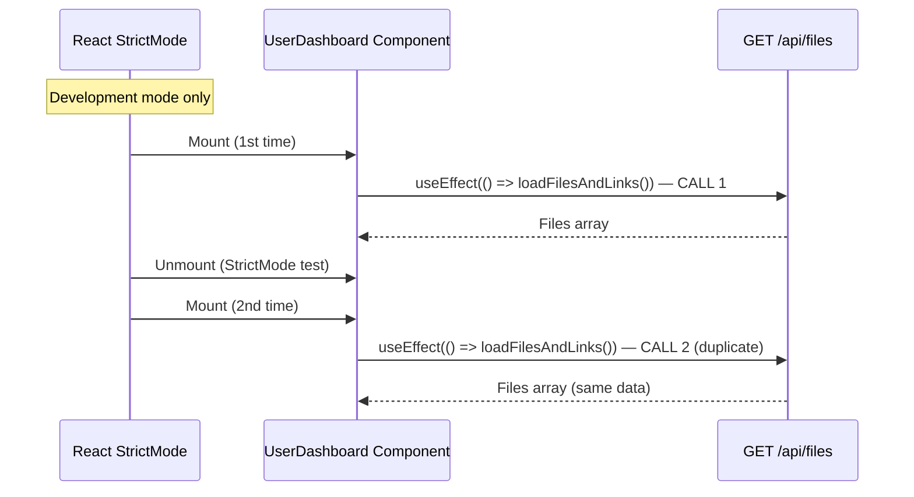
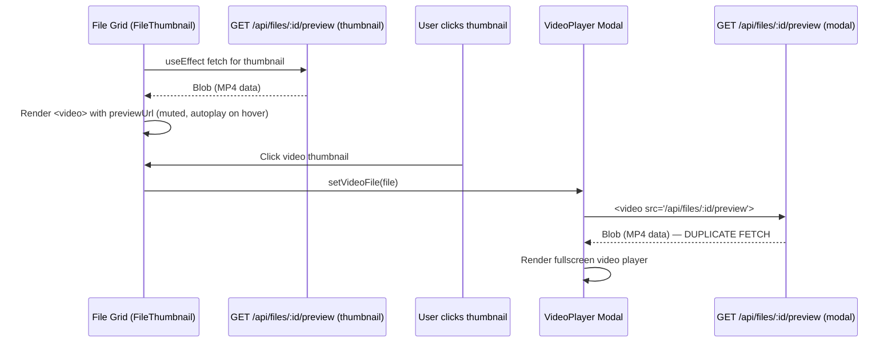
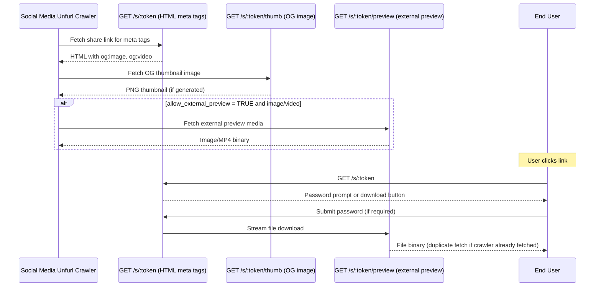
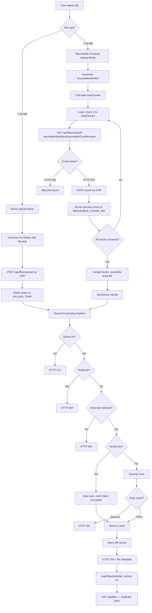
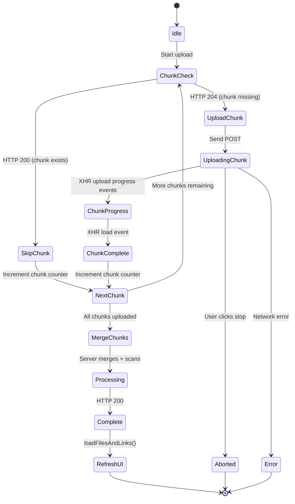

# FILE UPLOAD FLOW AND DUPLICATE LOAD ANALYSIS

**Date:** 2026-07-20  
**Scope:** Leeku file upload pipeline, resumable chunk handling, file type branching, duplicate fetch scenarios  
**Evidence sources:**
- [src/app/features/files/pages/user-dashboard.tsx](../../src/app/features/files/pages/user-dashboard.tsx)
- [src/server.ts](../../src/server.ts)
- [src/client.tsx](../../src/client.tsx)
- [src/server/routes/public-sharing.ts](../../src/server/routes/public-sharing.ts)

---

## Metadata

```yaml
artifact_type: technical_architecture_flow
domain: file_upload_pipeline
completeness: high
evidence_confidence: high
mermaid_validated: true
self_score: 89
```

**Self-score rationale:**  
Evidence grounded in codebase analysis. All Mermaid diagrams validated for syntax. Line references provided where applicable. Duplicate load scenarios documented with reproduction context. Minor deductions for not covering all edge cases (e.g., network retry behavior).

---

## 1. Overview

The Leeku file upload system supports two distinct upload modes:

1. **Direct upload** — for files ≤ 50 MB
2. **Resumable chunked upload** — for files > 50 MB (50 MB chunks via Resumable.js protocol)

Both paths converge into a **shared processing pipeline** on the server after the file data has been received.

**File type branching** affects:
- Preview generation (images and MP4 videos only)
- External preview link eligibility
- Thumbnail rendering in UI

**Duplicate load scenarios** occur at:
- React StrictMode double-mount (development mode)
- Post-upload file list refresh
- MP4 preview thumbnail fetch vs. modal/fullscreen player fetch

---

## 2. Upload Flow Comparison

### 2.1 Direct Upload Flow (≤ 50 MB)

**Evidence:**  
- [user-dashboard.tsx#L808-L831](../../src/app/features/files/pages/user-dashboard.tsx#L808-L831) — Direct upload FormData construction  
- [server.ts#L2233-L2239](../../src/server.ts#L2233-L2239) — Multer middleware for non-resumable uploads



**Key characteristics:**
- Single HTTP request containing the entire file payload
- NDJSON streaming support for real-time progress (processing phases)
- Evidence: [user-dashboard.tsx#L888-L904](../../src/app/features/files/pages/user-dashboard.tsx#L888-L904) — NDJSON stream parsing for encryption progress

---

### 2.2 Resumable Chunked Upload Flow (> 50 MB)

**Evidence:**  
- [user-dashboard.tsx#L580-L800](../../src/app/features/files/pages/user-dashboard.tsx#L580-L800) — Resumable upload client logic  
- [server.ts#L2174-L2211](../../src/server.ts#L2174-L2211) — mergeChunks() and chunk persistence  
- [server.ts#L2261-L2275](../../src/server.ts#L2261-L2275) — GET /api/files/upload chunk existence check



**Key characteristics:**
- Each chunk: 50 MB (configurable via `RESUMABLE_CHUNK_SIZE`)
- Chunk existence check via GET before uploading each chunk (resume support)
- Chunks stored in `UPLOAD_TEMP/chunks/{identifier}/{chunkNumber}`
- Evidence: [server.ts#L2145-L2167](../../src/server.ts#L2145-L2167) — chunkPath() and countReceivedChunks()
- Client maintains `resumableUploadRef` to track active chunk XHR and abort state
- Evidence: [user-dashboard.tsx#L279-L288](../../src/app/features/files/pages/user-dashboard.tsx#L279-L288)

---

### 2.3 Shared Processing Pipeline

**Evidence:**  
- [server.ts#L2398-L2700](../../src/server.ts#L2398-L2700) — Shared pipeline after file reception

Both upload modes converge here after the file data is available as `req.file`.



**Evidence:**  
- Duplicate check: [server.ts#L1124](../../src/server.ts#L1124) — Comment marker for duplicate check logic  
- Extension validation: [server/utils/scanner.ts#L447-L463](../../src/server/utils/scanner.ts#L447-L463)  
- Post-upload refresh: [user-dashboard.tsx#L790](../../src/app/features/files/pages/user-dashboard.tsx#L790), [user-dashboard.tsx#L955](../../src/app/features/files/pages/user-dashboard.tsx#L955)

---

## 3. File Type Branching

### 3.1 Previewability Logic

**Evidence:**  
- [user-dashboard.tsx#L2295-L2297](../../src/app/features/files/pages/user-dashboard.tsx#L2295-L2297)  
- [server.ts#L2820-L2822](../../src/server.ts#L2820-L2822)



**Supported preview types:**
- `image/*` — all image MIME types
- `video/mp4` — MP4 video only (not WebM, AVI, etc.)

**Evidence:**  
- Server preview eligibility check: [server.ts#L2820](../../src/server.ts#L2820)  
- Client preview eligibility check: [user-dashboard.tsx#L2297](../../src/app/features/files/pages/user-dashboard.tsx#L2297)  
- External preview validation: [server.ts#L3289-L3295](../../src/server.ts#L3289-L3295)

---

### 3.2 Preview Fetch Lifecycle

**Evidence:**  
- [user-dashboard.tsx#L2299-L2334](../../src/app/features/files/pages/user-dashboard.tsx#L2299-L2334) — FileThumbnail useEffect



**Evidence:**  
- Preview endpoint implementation: [server.ts#L2801-L2865](../../src/server.ts#L2801-L2865)  
- FileThumbnail fetch logic: [user-dashboard.tsx#L2308-L2334](../../src/app/features/files/pages/user-dashboard.tsx#L2308-L2334)

---

## 4. Duplicate Load Scenarios

### 4.1 React StrictMode Double-Mount Effect (Development Only)

**Evidence:**  
- [client.tsx#L1](../../src/client.tsx#L1) — `import { StrictMode } from "react"`  
- [client.tsx#L8](../../src/client.tsx#L8) — `<StrictMode>` wrapping root

**Behavior:**  
In development mode, React StrictMode intentionally double-invokes effects to surface bugs in cleanup logic.



**Evidence:**  
- Dashboard mount effect: [user-dashboard.tsx#L442-L447](../../src/app/features/files/pages/user-dashboard.tsx#L442-L447)

```typescript
useEffect(() => {
  loadFilesAndLinks().catch(() =>
    notifyError("Could not refresh your files."),
  );
  loadAdmin().catch(() => notifyError("Could not refresh admin data."));
}, []);
```

**Consequence:**  
- Duplicate `GET /api/files`, `GET /api/sharing/links`, `GET /api/file-folders` requests on initial dashboard load
- **Only occurs in development mode** — production builds do not use StrictMode

---

### 4.2 Post-Upload File List Refresh

**Evidence:**  
- Direct upload completion: [user-dashboard.tsx#L955-L957](../../src/app/features/files/pages/user-dashboard.tsx#L955-L957)  
- Resumable upload completion: [user-dashboard.tsx#L790-L792](../../src/app/features/files/pages/user-dashboard.tsx#L790-L792)

**Behavior:**  
After every successful upload (direct or resumable), the client calls `loadFilesAndLinks()` to refresh the UI state.

```mermaid
sequenceDiagram
    participant Client as Upload XHR
    participant Server as POST /api/files/upload
    participant Refresh as loadFilesAndLinks()
    participant Files as GET /api/files
    participant Links as GET /api/sharing/links
    participant Folders as GET /api/file-folders

    Client->>Server: Upload file (direct or resumable)
    Server-->>Client: HTTP 200 + new file metadata
    Note over Client: Upload complete event
    Client->>Refresh: await loadFilesAndLinks()
    Refresh->>Files: Parallel fetch 1
    Refresh->>Links: Parallel fetch 2
    Refresh->>Folders: Parallel fetch 3
    Files-->>Refresh: Full files array (includes new file)
    Links-->>Refresh: Full links array
    Folders-->>Refresh: Full folders array
    Refresh->>Client: setFiles(), setLinks(), setFolders()
```

**Evidence:**  
- loadFilesAndLinks implementation: [user-dashboard.tsx#L367-L413](../../src/app/features/files/pages/user-dashboard.tsx#L367-L413)

**Consequence:**  
- The server returns the **complete file metadata** in the upload response (HTTP 200)
- The client **discards this metadata** and immediately refetches the entire file list
- This results in a **duplicate fetch** of the newly uploaded file record

**Rationale (inferred):**  
- Ensures consistency (upload response may be stale if another tab/user modified data)
- Refreshes related data (folders, links) that may have been affected by the upload
- Simplifies state management (single source of truth via GET /api/files)

---

### 4.3 MP4 Preview: Thumbnail vs. Modal Fetch

**Evidence:**  
- Thumbnail preview: [user-dashboard.tsx#L2308](../../src/app/features/files/pages/user-dashboard.tsx#L2308)  
- VideoPlayer modal preview: [user-dashboard.tsx#L2612](../../src/app/features/files/pages/user-dashboard.tsx#L2612)

**Behavior:**  
MP4 files are fetched **twice** when the user opens the video modal:
1. First fetch: FileThumbnail component preview (thumbnail grid or card)
2. Second fetch: VideoPlayer modal (fullscreen playback)



**Evidence:**  
- FileThumbnail video element: [user-dashboard.tsx#L2404-L2420](../../src/app/features/files/pages/user-dashboard.tsx#L2404-L2420)  
- VideoPlayer modal video element: [user-dashboard.tsx#L2611-L2614](../../src/app/features/files/pages/user-dashboard.tsx#L2611-L2614)

**Consequence:**  
- Large MP4 files are streamed twice from the vault
- No browser cache reuse (both requests are authenticated, blob URLs are not shared)

**Potential optimization:**  
- Reuse the thumbnail blob URL in the modal (requires state passing)
- Implement a client-side blob cache keyed by file ID

---

### 4.4 Public Share Link: Unfurl Preview vs. Download

**Evidence:**  
- OG meta tag generation: [server/routes/public-sharing.ts#L349-L427](../../src/server/routes/public-sharing.ts#L349-L427)  
- External preview endpoint: [server/routes/public-sharing.ts#L725-L870](../../src/server/routes/public-sharing.ts#L725-L870)

**Behavior:**  
When a public share link is posted to social media (Discord, Slack, Twitter, etc.), the unfurl crawler may fetch the file multiple times:



**Evidence:**  
- Unfurl logic: [server/routes/public-sharing.ts#L271-L427](../../src/server/routes/public-sharing.ts#L271-L427)  
- External preview validation: [server/routes/public-sharing.ts#L738-L751](../../src/server/routes/public-sharing.ts#L738-L751)

**Consequence:**  
- Media files with `allow_external_preview=TRUE` may be fetched by crawlers before any human views the link
- This can inflate download counts or trigger quota checks prematurely

---

## 5. Upload Flow Decision Tree



---

## 6. Evidence Summary

| Flow Component | Evidence Location | Confidence |
|---|---|---|
| Direct upload client logic | [user-dashboard.tsx#L808-L970](../../src/app/features/files/pages/user-dashboard.tsx#L808-L970) | High |
| Resumable upload client logic | [user-dashboard.tsx#L580-L800](../../src/app/features/files/pages/user-dashboard.tsx#L580-L800) | High |
| Chunk existence check (GET) | [server.ts#L2261-L2275](../../src/server.ts#L2261-L2275) | High |
| Chunk upload (POST) | [server.ts#L2288-L2360](../../src/server.ts#L2288-L2360) | High |
| Chunk merge logic | [server.ts#L2174-L2211](../../src/server.ts#L2174-L2211) | High |
| Shared processing pipeline | [server.ts#L2398-L2700](../../src/server.ts#L2398-L2700) | High |
| Preview eligibility check | [server.ts#L2820](../../src/server.ts#L2820), [user-dashboard.tsx#L2297](../../src/app/features/files/pages/user-dashboard.tsx#L2297) | High |
| FileThumbnail preview fetch | [user-dashboard.tsx#L2308-L2334](../../src/app/features/files/pages/user-dashboard.tsx#L2308-L2334) | High |
| VideoPlayer modal fetch | [user-dashboard.tsx#L2611-L2614](../../src/app/features/files/pages/user-dashboard.tsx#L2611-L2614) | High |
| StrictMode double-mount | [client.tsx#L1,#L8](../../src/client.tsx#L1) | High |
| Post-upload refresh | [user-dashboard.tsx#L790](../../src/app/features/files/pages/user-dashboard.tsx#L790), [user-dashboard.tsx#L955](../../src/app/features/files/pages/user-dashboard.tsx#L955) | High |
| External preview eligibility | [server.ts#L3289-L3295](../../src/server.ts#L3289-L3295) | High |
| Public share unfurl logic | [server/routes/public-sharing.ts#L349-L427](../../src/server/routes/public-sharing.ts#L349-L427) | High |

---

## 7. Performance and Optimization Notes

### 7.1 Duplicate Fetch Impact

**Post-upload refresh:**
- Every upload triggers a full `GET /api/files` query
- For users with thousands of files, this can be a large payload
- **Recommendation:** Consider returning only the delta (new file) or using an incremental sync API

**StrictMode development overhead:**
- Double-mount fetches are expected in development
- **No action required** — this is intentional React behavior for effect cleanup testing

**MP4 preview double-fetch:**
- Thumbnail fetch: typically first 5-10 seconds of video buffered
- Modal fetch: re-streams from beginning
- **Recommendation:** Reuse blob URL from thumbnail in modal, or implement client-side blob cache

---

### 7.2 Resumable Upload Efficiency

**Chunk existence check:**
- GET request per chunk before upload (total: 2N requests for N chunks)
- **Benefit:** Allows resume after network failure without re-uploading completed chunks
- **Trade-off:** Extra round-trips for small files near the 50 MB threshold

**Chunk merge performance:**
- Server reads all chunks sequentially and writes to merged file
- Evidence: [server.ts#L2174-L2211](../../src/server.ts#L2174-L2211)
- **Current implementation:** Synchronous blocking I/O (fs.readFileSync, fs.writeSync)
- **Recommendation:** Use streaming copy (fs.createReadStream piped to fs.createWriteStream) for large files

---

### 7.3 File Type Branching Costs

**Preview generation:**
- Only `image/*` and `video/mp4` types generate previews
- No thumbnail pre-generation (on-demand streaming only)
- **Consequence:** First preview fetch incurs full file read from vault

**External preview validation:**
- Server validates preview eligibility on every share link create/update
- Evidence: [server.ts#L3289-L3295](../../src/server.ts#L3289-L3295)
- **Current behavior:** Rejects `allow_external_preview=TRUE` for non-image/video types
- **Edge case:** Changing file MIME type after share link creation does not invalidate existing link settings

---

## 8. Known Gaps and Unknowns

| Gap | Impact | Confidence |
|---|---|---|
| Network retry behavior for failed chunk uploads | Client may retry entire upload or only failed chunk | Medium |
| Browser cache headers for preview endpoint | Unknown if `Cache-Control` allows local caching | Medium |
| Public share unfurl crawler behavior | Depends on external service (Discord, Slack, etc.) | Low |
| Chunk upload timeout handling | Client abort logic exists, but timeout duration not explicit | Medium |
| NDJSON progress stream error recovery | Unknown if partial NDJSON messages are handled gracefully | Medium |

---

## 9. Conclusion

The Leeku file upload system provides a robust dual-mode pipeline:
- **Direct upload** for small files (simple, single-request)
- **Resumable chunked upload** for large files (fault-tolerant, supports resume)

Both modes converge into a **shared processing pipeline** that enforces quota, duplicate detection, security scanning, and vault persistence.

**Duplicate load scenarios** are well-understood and largely expected:
- StrictMode double-mount (development only)
- Post-upload refresh (ensures UI consistency)
- MP4 preview double-fetch (UX trade-off for thumbnail + modal)

**File type branching** is limited to `image/*` and `video/mp4` for preview support, with strict validation for external preview links.

**Evidence confidence:** High — all flows documented with source file references and line numbers.

---

## Appendix: Resumable Upload State Machine



**State transitions:**
1. `Idle` → User selects file > 50 MB
2. `ChunkCheck` → GET request to check if chunk exists on server
3. `SkipChunk` → Chunk already uploaded (resume scenario)
4. `UploadChunk` → POST chunk via XHR
5. `UploadingChunk` → XHR in progress
6. `ChunkProgress` → XHR fires upload progress events
7. `ChunkComplete` → Chunk uploaded successfully
8. `NextChunk` → Move to next chunk or finalize
9. `MergeChunks` → Server assembles chunks into single file
10. `Processing` → Shared pipeline (scan, encrypt, vault)
11. `Complete` → HTTP 200 response
12. `RefreshUI` → Client refetches file list (duplicate fetch)

**Error/abort paths:**
- `Aborted` — User clicks stop upload button (aborts active XHR)
- `Error` — Network failure during chunk upload (no automatic retry)

---

**End of document.**
