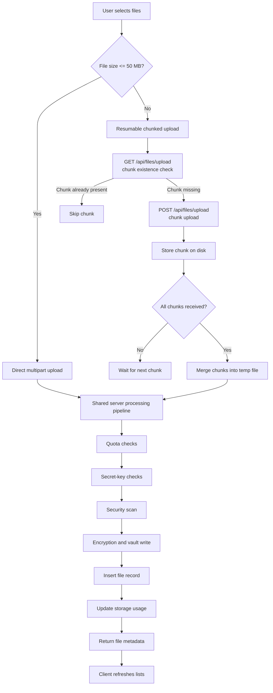
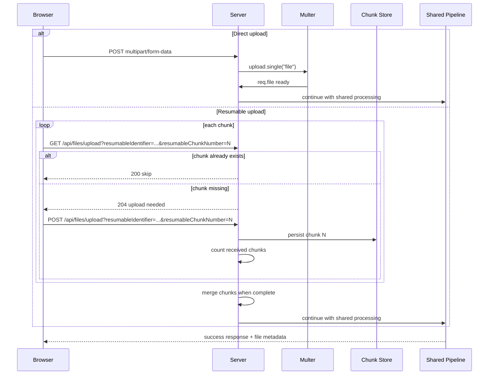
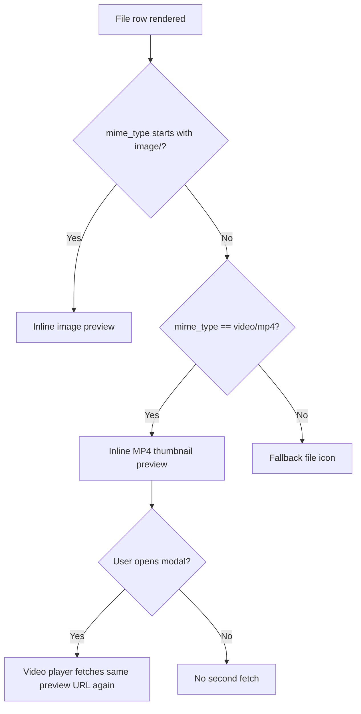

# Upload Flow Mermaid Analysis

Date: 2026-07-20

This document maps the file upload paths in the app and highlights where repeated loading can happen. The goal is to make the direct upload path, resumable upload path, and preview path visible in one place so duplicate fetches are easy to spot.

## Scope

Confirmed evidence points to these implementation surfaces:

- [src/app/features/files/pages/user-dashboard.tsx](../../src/app/features/files/pages/user-dashboard.tsx)
- [src/server.ts](../../src/server.ts)
- [src/client.tsx](../../src/client.tsx)

Key behavior:

- Small files use a direct multipart upload.
- Large files use a resumable chunked upload.
- Both paths converge into the same server-side processing pipeline.
- Images and MP4 files are previewable; other MIME types are not.
- MP4 previews can be fetched twice: once for the thumbnail and again for the video modal.
- Development StrictMode can double-run mount-time effects.

## File Type View

| Type | Upload path impact | Preview behavior |
|---|---|---|
| `image/*` | Upload path is the same as other files; size decides direct vs resumable | Previewable inline |
| `video/mp4` | Upload path is the same as other files; size decides direct vs resumable | Previewable inline and in modal |
| Other MIME types | Upload path is the same as other files; size decides direct vs resumable | Not previewable inline |

Evidence:

- Preview gating in the UI uses `image/*` and `video/mp4` checks in [src/app/features/files/pages/user-dashboard.tsx](../../src/app/features/files/pages/user-dashboard.tsx#L2299)
- Preview enforcement on the server only allows images and MP4 in [src/server.ts](../../src/server.ts#L2801)

## Mermaid: End-to-End Upload Overview



Evidence:

- Direct upload and resumable upload logic in [src/app/features/files/pages/user-dashboard.tsx](../../src/app/features/files/pages/user-dashboard.tsx#L580)
- Shared upload dispatcher and pipeline in [src/server.ts](../../src/server.ts#L2190)
- Chunk existence check in [src/server.ts](../../src/server.ts#L2210)

## Mermaid: Direct vs Resumable Upload



Evidence:

- Client-side resumable loop in [src/app/features/files/pages/user-dashboard.tsx](../../src/app/features/files/pages/user-dashboard.tsx#L580)
- Server-side resumable chunk handling in [src/server.ts](../../src/server.ts#L2261)
- Shared processing after upload in [src/server.ts](../../src/server.ts#L2398)

## Mermaid: Where Duplicate Loads Can Happen

```mermaid
flowchart TD
    A[Initial dashboard mount] --> B{React StrictMode in dev?}
    B -->|Yes| C[Mount effect can run twice]
    B -->|No| D[Normal single mount]

    C --> E[loadFilesAndLinks()]
    D --> E

    E --> F[GET /api/files]
    E --> G[GET /api/sharing/links]
    E --> H[GET /api/file-folders]

    I[Upload completes] --> J[loadFilesAndLinks() runs again]
    J --> F
    J --> G
    J --> H

    K[Open MP4 thumbnail] --> L[GET /api/files/:id/preview]
    L --> M[Open video modal]
    M --> N[GET /api/files/:id/preview again]
```

Evidence:

- Dashboard mount effect calls refresh functions in [src/app/features/files/pages/user-dashboard.tsx](../../src/app/features/files/pages/user-dashboard.tsx#L441)
- StrictMode wraps the app in [src/client.tsx](../../src/client.tsx#L1)
- Upload completion refreshes the lists in [src/app/features/files/pages/user-dashboard.tsx](../../src/app/features/files/pages/user-dashboard.tsx#L787)
- Thumbnail preview fetch happens in [src/app/features/files/pages/user-dashboard.tsx](../../src/app/features/files/pages/user-dashboard.tsx#L2299)
- Video modal uses the same preview route in [src/app/features/files/pages/user-dashboard.tsx](../../src/app/features/files/pages/user-dashboard.tsx#L2612)

## Mermaid: Preview Branching



Evidence:

- UI preview branch in [src/app/features/files/pages/user-dashboard.tsx](../../src/app/features/files/pages/user-dashboard.tsx#L2299)
- Server preview gate in [src/server.ts](../../src/server.ts#L2801)

## What This Shows

1. The upload path itself is not type-based in the transport layer; file size selects direct or resumable.
2. The same file can trigger more than one fetch after upload because the client refreshes the full file list.
3. MP4 files can be fetched twice for preview, once in the thumbnail and once in the modal.
4. Development StrictMode can add another duplicate load on mount, but that is a dev-only behavior.

## Notes

- `⚠️ INFERRED`: The duplicate load risk is a behavior analysis, not a declared bug in the code.
- `✅ CONFIRMED`: The upload, refresh, preview, and StrictMode entry points are present in the codebase.
